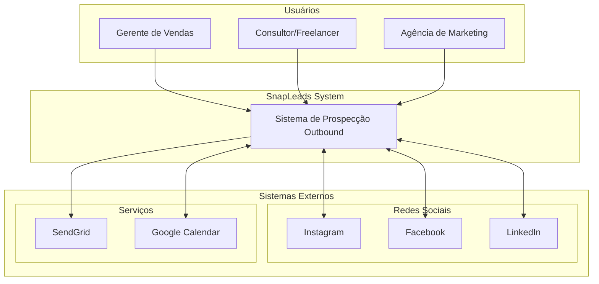
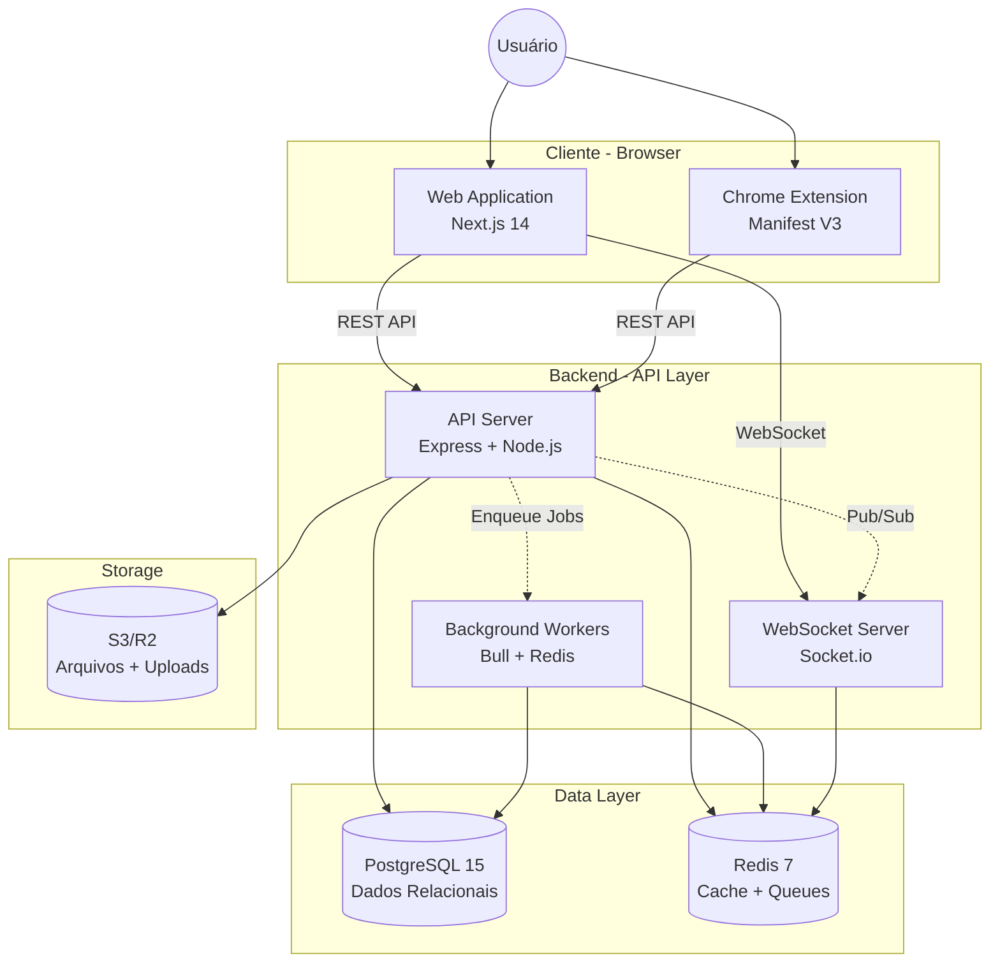
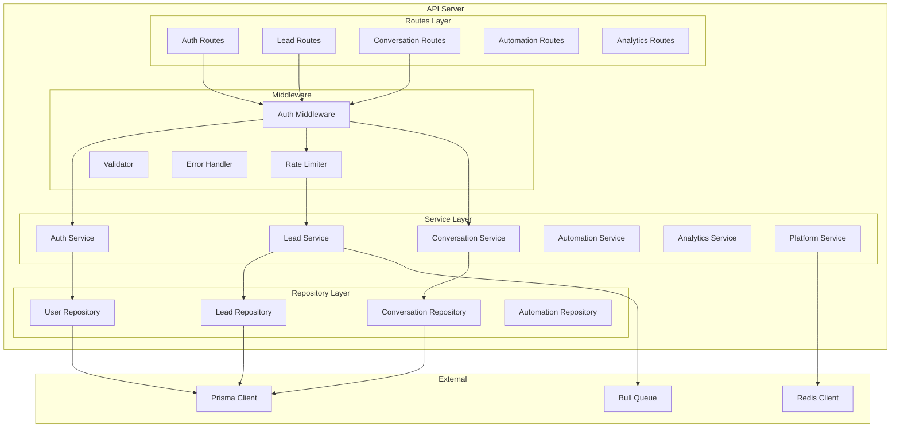
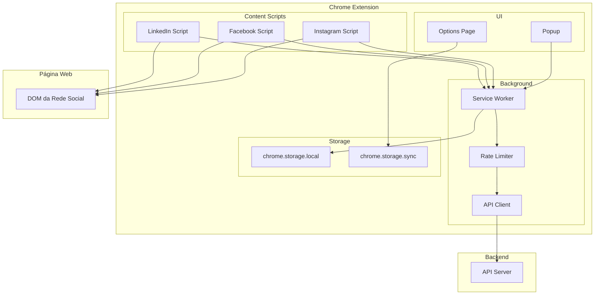
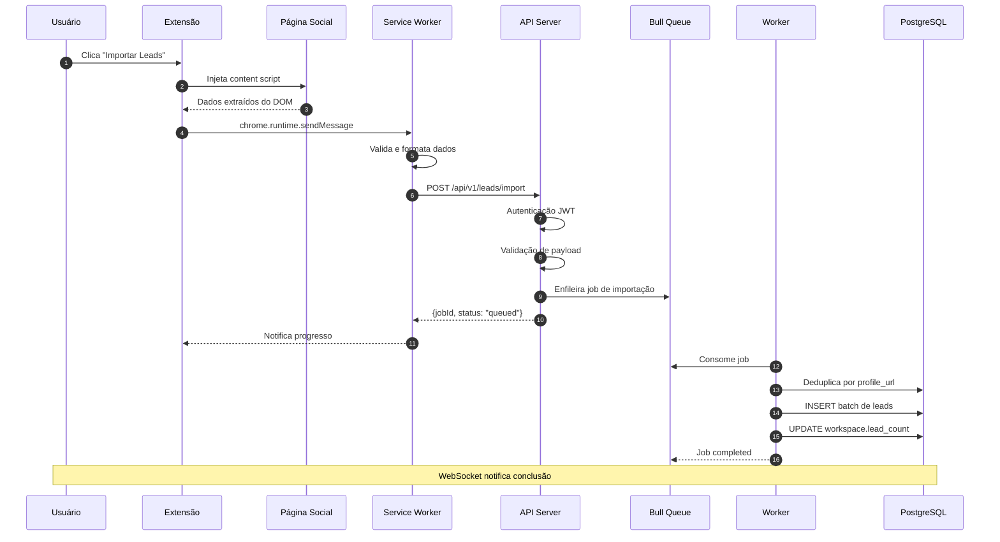
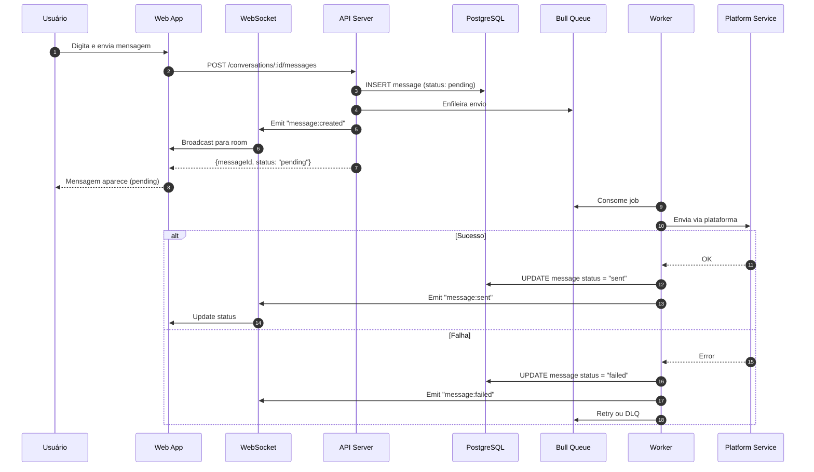
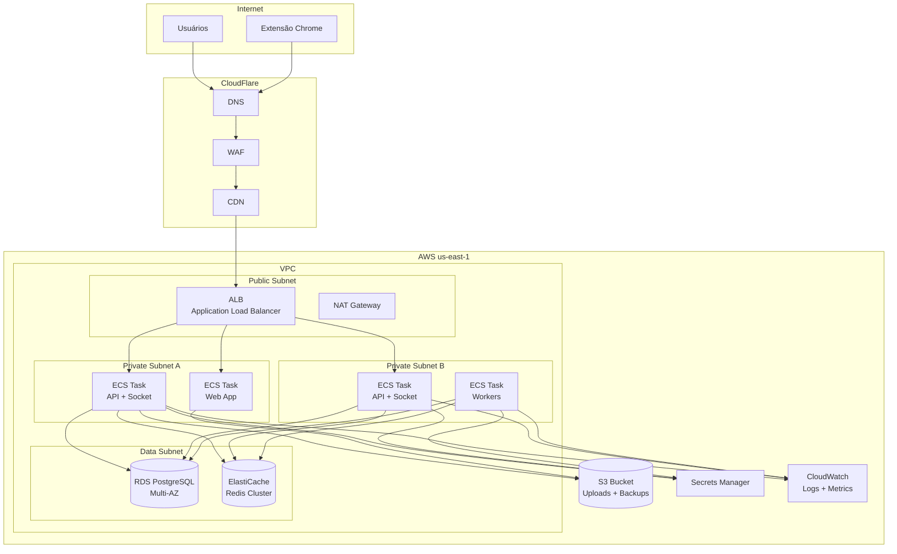

# Diagramas C4 - SnapLeads MVP

Este documento contém os diagramas C4 detalhados do sistema, organizados por nível de abstração.

---

## Level 1: Diagrama de Contexto

Visão de alto nível do sistema e suas interações com usuários e sistemas externos.

### Atores

| Ator | Descrição | Interações Principais |
|------|-----------|----------------------|
| Gerente de Vendas | Gerencia equipe, analisa métricas | Dashboard, relatórios, gestão de equipe |
| Consultor/Freelancer | Prospecção individual | Importação, inbox, automações |
| Agência de Marketing | Multi-clientes, alto volume | Workspaces múltiplos, white-label |

### Sistemas Externos

| Sistema | Tipo | Integração |
|---------|------|------------|
| Instagram | Rede Social | Scraping via extensão, API Graph (limitada) |
| Facebook | Rede Social | Scraping via extensão, API Graph |
| LinkedIn | Rede Social | Scraping via extensão |
| SendGrid | Email | API REST para notificações |
| Google Calendar | Calendário | OAuth2, API REST |

---

## Level 2: Diagrama de Containers

Decomposição do sistema em containers de aplicação e dados.

### Container: Web Application

| Aspecto | Detalhe |
|---------|---------|
| **Tecnologia** | Next.js 14, React 18, TypeScript |
| **Responsabilidades** | UI do dashboard, inbox, analytics |
| **Comunicação** | REST API, WebSocket |
| **Estado** | Zustand (local), TanStack Query (servidor) |

### Container: Chrome Extension

| Aspecto | Detalhe |
|---------|---------|
| **Tecnologia** | Manifest V3, TypeScript |
| **Responsabilidades** | Scraping de leads, UI popup |
| **Comunicação** | REST API com bearer token |
| **Armazenamento** | chrome.storage para config |

### Container: API Server

| Aspecto | Detalhe |
|---------|---------|
| **Tecnologia** | Express 4, Node.js 20, TypeScript |
| **Responsabilidades** | REST endpoints, auth, validação |
| **Comunicação** | HTTP/REST, integrado com Socket.io |
| **Padrões** | Controller-Service-Repository |

### Container: WebSocket Server

| Aspecto | Detalhe |
|---------|---------|
| **Tecnologia** | Socket.io 4 |
| **Responsabilidades** | Eventos realtime, presence |
| **Comunicação** | WebSocket com fallback |
| **Scaling** | Redis adapter para multi-instance |

### Container: Background Workers

| Aspecto | Detalhe |
|---------|---------|
| **Tecnologia** | Bull (BullMQ), Node.js |
| **Responsabilidades** | Jobs assíncronos, processamento em lote |
| **Filas** | imports, messages, automations, scoring |
| **Retry** | Exponential backoff, dead letter queue |

---

## Level 3: Diagrama de Componentes

### API Server - Componentes

### Componentes do API Server

| Componente | Responsabilidade |
|------------|------------------|
| **Auth Routes** | Login, logout, refresh, registro |
| **Lead Routes** | CRUD leads, importação, tagging |
| **Conversation Routes** | Listar conversas, enviar mensagens |
| **Automation Routes** | CRUD automações, toggle, logs |
| **Analytics Routes** | Métricas, funil, relatórios |
| **Auth Service** | JWT, bcrypt, validação de sessão |
| **Lead Service** | Lógica de negócio de leads |
| **Conversation Service** | Gestão de conversas e mensagens |
| **Platform Service** | Abstração de envio por plataforma |

---

## Level 3: Extension - Componentes

### Componentes da Extensão

| Componente | Responsabilidade |
|------------|------------------|
| **Service Worker** | Orquestra comunicação, mantém estado |
| **API Client** | Comunicação HTTP com backend |
| **Rate Limiter** | Controle local de rate limiting |
| **Instagram Script** | Extração de dados do Instagram |
| **Facebook Script** | Extração de dados do Facebook |
| **LinkedIn Script** | Extração de dados do LinkedIn |
| **Popup** | Interface rápida, status, ações |
| **Options Page** | Configurações, login |

---

## Fluxos de Dados Detalhados

### Fluxo: Importação de Leads via Extensão

### Fluxo: Envio de Mensagem

---

## Diagrama de Deployment (Produção)

---

## Legenda

| Símbolo | Significado |
|---------|-------------|
| Retângulo | Container/Componente |
| Cilindro | Banco de Dados/Storage |
| Seta sólida | Comunicação síncrona |
| Seta tracejada | Comunicação assíncrona |
| Subgraph | Agrupamento lógico |

---

## Referências

- [C4 Model - Simon Brown](https://c4model.com/)
- [Mermaid C4 Diagrams](https://mermaid.js.org/syntax/c4.html)
- [AWS Architecture Icons](https://aws.amazon.com/architecture/icons/)
