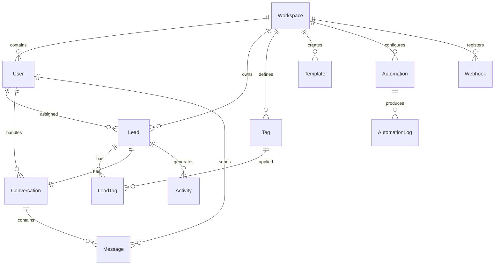

# Modelo de Dados - SnapLeads MVP

Este documento especifica o modelo de dados para o MVP, utilizando PostgreSQL como banco relacional e Prisma como ORM.

---

## Visão Geral

### Entidades Principais



---

## Prisma Schema

```prisma
// packages/database/prisma/schema.prisma

generator client {
  provider = "prisma-client-js"
}

datasource db {
  provider = "postgresql"
  url      = env("DATABASE_URL")
}

// ============================================
// WORKSPACE & USERS
// ============================================

model Workspace {
  id        String   @id @default(cuid())
  name      String
  plan      Plan     @default(trial)
  settings  Json     @default("{}")
  createdAt DateTime @default(now())
  updatedAt DateTime @updatedAt

  // Relations
  users       User[]
  leads       Lead[]
  tags        Tag[]
  templates   Template[]
  automations Automation[]
  webhooks    Webhook[]
  invitations Invitation[]

  @@map("workspaces")
}

enum Plan {
  trial
  starter
  professional
  business
  enterprise
}

model User {
  id           String    @id @default(cuid())
  email        String    @unique
  passwordHash String
  fullName     String
  avatarUrl    String?
  role         Role      @default(agent)
  settings     Json      @default("{}")
  lastLoginAt  DateTime?
  createdAt    DateTime  @default(now())
  updatedAt    DateTime  @updatedAt

  // Relations
  workspaceId String
  workspace   Workspace @relation(fields: [workspaceId], references: [id], onDelete: Cascade)

  assignedLeads        Lead[]         @relation("AssignedLeads")
  assignedConversations Conversation[] @relation("AssignedConversations")
  sentMessages         Message[]      @relation("SentMessages")
  createdTemplates     Template[]     @relation("CreatedTemplates")
  createdAutomations   Automation[]   @relation("CreatedAutomations")
  activities           Activity[]     @relation("UserActivities")

  @@index([workspaceId])
  @@index([email])
  @@map("users")
}

enum Role {
  owner
  admin
  manager
  agent
  viewer
}

model Invitation {
  id        String           @id @default(cuid())
  email     String
  role      Role             @default(agent)
  token     String           @unique @default(cuid())
  status    InvitationStatus @default(pending)
  expiresAt DateTime
  createdAt DateTime         @default(now())

  workspaceId String
  workspace   Workspace @relation(fields: [workspaceId], references: [id], onDelete: Cascade)

  @@unique([workspaceId, email])
  @@index([token])
  @@map("invitations")
}

enum InvitationStatus {
  pending
  accepted
  expired
}

model RefreshToken {
  id        String   @id @default(cuid())
  token     String   @unique
  userId    String
  expiresAt DateTime
  createdAt DateTime @default(now())

  @@index([userId])
  @@index([token])
  @@map("refresh_tokens")
}

// ============================================
// LEADS
// ============================================

model Lead {
  id             String      @id @default(cuid())
  platform       Platform
  username       String?
  fullName       String?
  profileUrl     String?
  avatarUrl      String?
  bio            String?
  email          String?
  phone          String?
  website        String?
  location       String?
  followersCount Int?
  followingCount Int?
  postsCount     Int?
  verified       Boolean     @default(false)
  score          Int         @default(0)
  status         LeadStatus  @default(new)
  notes          String?
  sourceUrl      String?
  customFields   Json        @default("{}")
  lastInteractionAt DateTime?
  createdAt      DateTime    @default(now())
  updatedAt      DateTime    @updatedAt

  // Relations
  workspaceId String
  workspace   Workspace @relation(fields: [workspaceId], references: [id], onDelete: Cascade)

  assignedToId String?
  assignedTo   User?   @relation("AssignedLeads", fields: [assignedToId], references: [id], onDelete: SetNull)

  tags         LeadTag[]
  conversation Conversation?
  activities   Activity[]
  automationLogs AutomationLog[]

  @@unique([workspaceId, platform, profileUrl])
  @@index([workspaceId, status])
  @@index([workspaceId, platform])
  @@index([workspaceId, score])
  @@index([workspaceId, createdAt])
  @@index([assignedToId])
  @@map("leads")
}

enum Platform {
  instagram
  facebook
  linkedin
  twitter
  tiktok
  whatsapp
  telegram
  discord
  reddit
  skool
  slack
  pinterest
  youtube
  nextdoor
  gohighlevel
  other
}

enum LeadStatus {
  new
  contacted
  responded
  qualified
  scheduled
  closed
  lost
}

// ============================================
// TAGS
// ============================================

model Tag {
  id        String   @id @default(cuid())
  name      String
  color     String   @default("#6366F1")
  createdAt DateTime @default(now())

  workspaceId String
  workspace   Workspace @relation(fields: [workspaceId], references: [id], onDelete: Cascade)

  leads LeadTag[]

  @@unique([workspaceId, name])
  @@map("tags")
}

model LeadTag {
  leadId    String
  lead      Lead     @relation(fields: [leadId], references: [id], onDelete: Cascade)
  
  tagId     String
  tag       Tag      @relation(fields: [tagId], references: [id], onDelete: Cascade)
  
  createdAt DateTime @default(now())

  @@id([leadId, tagId])
  @@map("lead_tags")
}

// ============================================
// CONVERSATIONS & MESSAGES
// ============================================

model Conversation {
  id            String             @id @default(cuid())
  platform      Platform
  status        ConversationStatus @default(active)
  unreadCount   Int                @default(0)
  lastMessageAt DateTime?
  createdAt     DateTime           @default(now())
  updatedAt     DateTime           @updatedAt

  // Relations
  leadId String @unique
  lead   Lead   @relation(fields: [leadId], references: [id], onDelete: Cascade)

  assignedToId String?
  assignedTo   User?   @relation("AssignedConversations", fields: [assignedToId], references: [id], onDelete: SetNull)

  messages Message[]

  @@index([leadId])
  @@index([assignedToId])
  @@index([status, lastMessageAt])
  @@map("conversations")
}

enum ConversationStatus {
  active
  archived
}

model Message {
  id          String        @id @default(cuid())
  content     String
  senderType  SenderType
  messageType MessageType   @default(text)
  status      MessageStatus @default(pending)
  metadata    Json          @default("{}")
  readAt      DateTime?
  sentAt      DateTime      @default(now())

  // Relations
  conversationId String
  conversation   Conversation @relation(fields: [conversationId], references: [id], onDelete: Cascade)

  senderId String?
  sender   User?   @relation("SentMessages", fields: [senderId], references: [id], onDelete: SetNull)

  @@index([conversationId, sentAt])
  @@map("messages")
}

enum SenderType {
  agent
  lead
  system
}

enum MessageType {
  text
  image
  video
  audio
  document
  template
}

enum MessageStatus {
  pending
  sent
  delivered
  read
  failed
}

// ============================================
// TEMPLATES
// ============================================

model Template {
  id        String    @id @default(cuid())
  name      String
  content   String
  platform  Platform?
  category  String?
  variables Json      @default("[]")
  stats     Json      @default("{\"sent\": 0, \"responseRate\": 0}")
  createdAt DateTime  @default(now())
  updatedAt DateTime  @updatedAt

  workspaceId String
  workspace   Workspace @relation(fields: [workspaceId], references: [id], onDelete: Cascade)

  createdById String
  createdBy   User   @relation("CreatedTemplates", fields: [createdById], references: [id], onDelete: Cascade)

  @@index([workspaceId])
  @@map("templates")
}

// ============================================
// AUTOMATIONS
// ============================================

model Automation {
  id            String  @id @default(cuid())
  name          String
  description   String?
  triggerType   String
  triggerConfig Json
  actions       Json
  conditions    Json    @default("[]")
  enabled       Boolean @default(true)
  stats         Json    @default("{\"runs\": 0, \"success\": 0, \"failed\": 0}")
  createdAt     DateTime @default(now())
  updatedAt     DateTime @updatedAt

  workspaceId String
  workspace   Workspace @relation(fields: [workspaceId], references: [id], onDelete: Cascade)

  createdById String
  createdBy   User   @relation("CreatedAutomations", fields: [createdById], references: [id], onDelete: Cascade)

  logs AutomationLog[]

  @@index([workspaceId, enabled])
  @@map("automations")
}

model AutomationLog {
  id            String              @id @default(cuid())
  status        AutomationLogStatus
  actionsExecuted Int               @default(0)
  errorMessage  String?
  metadata      Json                @default("{}")
  executedAt    DateTime            @default(now())

  automationId String
  automation   Automation @relation(fields: [automationId], references: [id], onDelete: Cascade)

  leadId String?
  lead   Lead?   @relation(fields: [leadId], references: [id], onDelete: SetNull)

  @@index([automationId, executedAt])
  @@map("automation_logs")
}

enum AutomationLogStatus {
  success
  failed
  skipped
}

// ============================================
// ACTIVITIES (Audit Trail)
// ============================================

model Activity {
  id           String       @id @default(cuid())
  type         ActivityType
  description  String?
  metadata     Json         @default("{}")
  createdAt    DateTime     @default(now())

  // Relations
  leadId String?
  lead   Lead?   @relation(fields: [leadId], references: [id], onDelete: Cascade)

  userId String?
  user   User?   @relation("UserActivities", fields: [userId], references: [id], onDelete: SetNull)

  @@index([leadId, createdAt])
  @@index([userId, createdAt])
  @@map("activities")
}

enum ActivityType {
  lead_created
  lead_updated
  lead_imported
  status_changed
  tag_added
  tag_removed
  assigned
  message_sent
  message_received
  score_updated
  automation_triggered
  note_added
}

// ============================================
// WEBHOOKS
// ============================================

model Webhook {
  id            String   @id @default(cuid())
  url           String
  events        String[]
  secret        String?
  enabled       Boolean  @default(true)
  lastTriggeredAt DateTime?
  createdAt     DateTime @default(now())
  updatedAt     DateTime @updatedAt

  workspaceId String
  workspace   Workspace @relation(fields: [workspaceId], references: [id], onDelete: Cascade)

  @@index([workspaceId])
  @@map("webhooks")
}

// ============================================
// IMPORT JOBS
// ============================================

model ImportJob {
  id          String          @id @default(cuid())
  workspaceId String
  platform    Platform
  sourceUrl   String?
  status      ImportJobStatus @default(queued)
  progress    Int             @default(0)
  totalLeads  Int             @default(0)
  result      Json?
  error       String?
  createdAt   DateTime        @default(now())
  completedAt DateTime?

  @@index([workspaceId, createdAt])
  @@map("import_jobs")
}

enum ImportJobStatus {
  queued
  processing
  completed
  failed
}
```

---

## Detalhes das Tabelas

### Workspace

Representa uma conta/organização no sistema.

| Campo | Tipo | Descrição |
|-------|------|-----------|
| id | CUID | Identificador único |
| name | String | Nome do workspace |
| plan | Enum | Plano de assinatura |
| settings | JSON | Configurações customizadas |

**Índices:** PK em `id`

---

### User

Usuários do sistema.

| Campo | Tipo | Descrição |
|-------|------|-----------|
| id | CUID | Identificador único |
| email | String | Email único |
| passwordHash | String | Hash bcrypt da senha |
| fullName | String | Nome completo |
| role | Enum | Papel no workspace |
| workspaceId | FK | Workspace associado |

**Índices:** `email` (unique), `workspaceId`

---

### Lead

Leads importados das redes sociais.

| Campo | Tipo | Descrição |
|-------|------|-----------|
| id | CUID | Identificador único |
| platform | Enum | Plataforma de origem |
| username | String | Username na plataforma |
| profileUrl | String | URL do perfil |
| score | Int | Pontuação (0-100) |
| status | Enum | Status no funil |
| customFields | JSON | Campos personalizados |

**Índices:** 
- Unique: `(workspaceId, platform, profileUrl)` - evita duplicatas
- `(workspaceId, status)` - filtros comuns
- `(workspaceId, platform)` - filtros por plataforma
- `(workspaceId, score)` - ordenação por score
- `assignedToId` - busca por responsável

---

### Conversation

Conversas com leads (1:1 com Lead).

| Campo | Tipo | Descrição |
|-------|------|-----------|
| id | CUID | Identificador único |
| leadId | FK | Lead associado (unique) |
| platform | Enum | Plataforma da conversa |
| unreadCount | Int | Mensagens não lidas |
| lastMessageAt | DateTime | Última mensagem |

**Índices:** `leadId` (unique), `(status, lastMessageAt)`

---

### Message

Mensagens em conversas.

| Campo | Tipo | Descrição |
|-------|------|-----------|
| id | CUID | Identificador único |
| conversationId | FK | Conversa associada |
| content | Text | Conteúdo da mensagem |
| senderType | Enum | agent, lead, system |
| status | Enum | pending, sent, delivered, read, failed |

**Índices:** `(conversationId, sentAt)` - paginação cronológica

---

### Template

Templates de mensagens reutilizáveis.

| Campo | Tipo | Descrição |
|-------|------|-----------|
| id | CUID | Identificador único |
| name | String | Nome do template |
| content | Text | Conteúdo com variáveis |
| variables | JSON | Lista de variáveis detectadas |
| stats | JSON | Estatísticas de uso |

---

### Automation

Automações configuradas.

| Campo | Tipo | Descrição |
|-------|------|-----------|
| id | CUID | Identificador único |
| triggerType | String | Tipo de gatilho |
| triggerConfig | JSON | Configuração do gatilho |
| actions | JSON | Lista de ações |
| conditions | JSON | Condições opcionais |
| enabled | Bool | Ativo/inativo |
| stats | JSON | Contadores de execução |

---

### Activity

Trail de auditoria de ações.

| Campo | Tipo | Descrição |
|-------|------|-----------|
| id | CUID | Identificador único |
| type | Enum | Tipo de atividade |
| leadId | FK | Lead relacionado |
| userId | FK | Usuário que executou |
| metadata | JSON | Detalhes adicionais |

**Índices:** `(leadId, createdAt)`, `(userId, createdAt)`

---

## Migrations Iniciais

### Migration 001: Schema Base

```sql
-- CreateExtension
CREATE EXTENSION IF NOT EXISTS "pg_trgm";

-- CreateEnum
CREATE TYPE "Plan" AS ENUM ('trial', 'starter', 'professional', 'business', 'enterprise');
CREATE TYPE "Role" AS ENUM ('owner', 'admin', 'manager', 'agent', 'viewer');
CREATE TYPE "Platform" AS ENUM ('instagram', 'facebook', 'linkedin', 'twitter', 'tiktok', 'whatsapp', 'telegram', 'discord', 'reddit', 'skool', 'slack', 'pinterest', 'youtube', 'nextdoor', 'gohighlevel', 'other');
CREATE TYPE "LeadStatus" AS ENUM ('new', 'contacted', 'responded', 'qualified', 'scheduled', 'closed', 'lost');
CREATE TYPE "ConversationStatus" AS ENUM ('active', 'archived');
CREATE TYPE "SenderType" AS ENUM ('agent', 'lead', 'system');
CREATE TYPE "MessageType" AS ENUM ('text', 'image', 'video', 'audio', 'document', 'template');
CREATE TYPE "MessageStatus" AS ENUM ('pending', 'sent', 'delivered', 'read', 'failed');
CREATE TYPE "ActivityType" AS ENUM ('lead_created', 'lead_updated', 'lead_imported', 'status_changed', 'tag_added', 'tag_removed', 'assigned', 'message_sent', 'message_received', 'score_updated', 'automation_triggered', 'note_added');
CREATE TYPE "AutomationLogStatus" AS ENUM ('success', 'failed', 'skipped');
CREATE TYPE "InvitationStatus" AS ENUM ('pending', 'accepted', 'expired');
CREATE TYPE "ImportJobStatus" AS ENUM ('queued', 'processing', 'completed', 'failed');

-- CreateTable workspaces
CREATE TABLE "workspaces" (
    "id" TEXT NOT NULL,
    "name" TEXT NOT NULL,
    "plan" "Plan" NOT NULL DEFAULT 'trial',
    "settings" JSONB NOT NULL DEFAULT '{}',
    "createdAt" TIMESTAMP(3) NOT NULL DEFAULT CURRENT_TIMESTAMP,
    "updatedAt" TIMESTAMP(3) NOT NULL,

    CONSTRAINT "workspaces_pkey" PRIMARY KEY ("id")
);

-- CreateTable users
CREATE TABLE "users" (
    "id" TEXT NOT NULL,
    "email" TEXT NOT NULL,
    "passwordHash" TEXT NOT NULL,
    "fullName" TEXT NOT NULL,
    "avatarUrl" TEXT,
    "role" "Role" NOT NULL DEFAULT 'agent',
    "settings" JSONB NOT NULL DEFAULT '{}',
    "lastLoginAt" TIMESTAMP(3),
    "createdAt" TIMESTAMP(3) NOT NULL DEFAULT CURRENT_TIMESTAMP,
    "updatedAt" TIMESTAMP(3) NOT NULL,
    "workspaceId" TEXT NOT NULL,

    CONSTRAINT "users_pkey" PRIMARY KEY ("id")
);

-- ... (continua para todas as tabelas)
```

---

## Queries Comuns

### Listar leads com filtros

```sql
SELECT 
  l.*,
  u.full_name as assigned_to_name,
  array_agg(json_build_object('id', t.id, 'name', t.name, 'color', t.color)) as tags
FROM leads l
LEFT JOIN users u ON l.assigned_to_id = u.id
LEFT JOIN lead_tags lt ON l.id = lt.lead_id
LEFT JOIN tags t ON lt.tag_id = t.id
WHERE l.workspace_id = $1
  AND ($2::platform IS NULL OR l.platform = $2)
  AND ($3::lead_status IS NULL OR l.status = $3)
  AND ($4::text IS NULL OR l.full_name ILIKE '%' || $4 || '%' OR l.username ILIKE '%' || $4 || '%')
GROUP BY l.id, u.full_name
ORDER BY l.created_at DESC
LIMIT $5 OFFSET $6;
```

### Contagem por status (funil)

```sql
SELECT 
  status,
  COUNT(*) as count
FROM leads
WHERE workspace_id = $1
  AND created_at >= $2
  AND created_at <= $3
GROUP BY status;
```

### Conversas não lidas

```sql
SELECT 
  c.*,
  l.username,
  l.full_name,
  l.avatar_url,
  l.platform
FROM conversations c
JOIN leads l ON c.lead_id = l.id
WHERE c.assigned_to_id = $1
  AND c.unread_count > 0
  AND c.status = 'active'
ORDER BY c.last_message_at DESC;
```

---

## Considerações de Performance

### Índices Recomendados

1. **Full-text search** em leads:
```sql
CREATE INDEX leads_search_idx ON leads 
USING gin(to_tsvector('portuguese', coalesce(full_name, '') || ' ' || coalesce(username, '') || ' ' || coalesce(bio, '')));
```

2. **Trigram para busca fuzzy**:
```sql
CREATE INDEX leads_username_trgm_idx ON leads USING gin(username gin_trgm_ops);
CREATE INDEX leads_fullname_trgm_idx ON leads USING gin(full_name gin_trgm_ops);
```

### Particionamento (Futuro)

Para workspaces com muitos leads, considerar particionamento por `workspace_id`:

```sql
CREATE TABLE leads (
    ...
) PARTITION BY HASH (workspace_id);

CREATE TABLE leads_p0 PARTITION OF leads FOR VALUES WITH (MODULUS 4, REMAINDER 0);
CREATE TABLE leads_p1 PARTITION OF leads FOR VALUES WITH (MODULUS 4, REMAINDER 1);
-- etc.
```

### Cache Strategy

| Dado | TTL | Invalidação |
|------|-----|-------------|
| User (por ID) | 5 min | On update |
| Workspace settings | 10 min | On update |
| Tags list | 5 min | On create/update/delete |
| Lead count por status | 1 min | On status change |
| Unread conversations count | Real-time via pub/sub |

---

## Backup & Recovery

### Estratégia

| Tipo | Frequência | Retenção |
|------|------------|----------|
| Full backup | Diário (2am) | 30 dias |
| WAL archiving | Contínuo | 7 dias |
| Point-in-time | Últimas 24h | - |

### Comandos

```bash
# Backup manual
pg_dump -Fc snapleads > backup_$(date +%Y%m%d).dump

# Restore
pg_restore -d snapleads backup_20250115.dump

# PITR (RDS)
aws rds restore-db-instance-to-point-in-time \
  --source-db-instance-identifier snapleads-prod \
  --target-db-instance-identifier snapleads-restored \
  --restore-time "2025-01-15T10:00:00Z"
```
